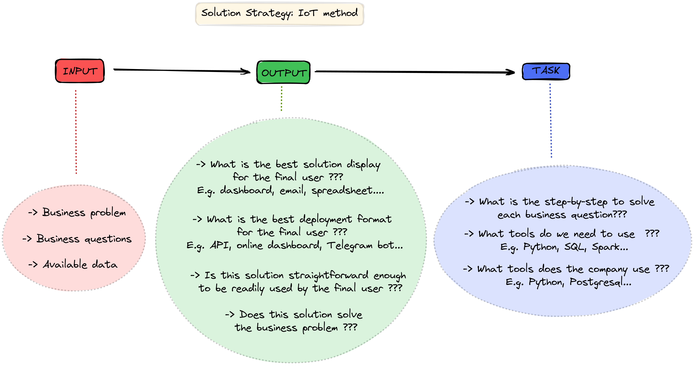

# **BUSINESS UNDERSTANDING**

## **What is the company?**

Blocker Fraud Company

## **What is its business model?**

Blocker Fraud Company is a company specialized in the detection of fraud in financial transactions made through mobile devices. The company has a service called "Blocker Fraud" which guarantees the blocking of fraudulent transactions. 

## **What is the business problem the company is facing?**

Blocker Fraud Company is expanding in Brazil and, to find new customers more quickly, it has adopted a very aggressive strategy. The strategy works as follows:

* ***The company will receive 25% of each transaction value that was correctly detected as fraud.***

* ***The company will receive 5% of each transaction value that was detected as a fraud despite being legitimate.***

* ***The company will return 100% of each transaction value that was detected as legitimate despite being a fraud.***

In other words, the company takes the risk of failing to detect fraud and earns money when correctly detecting fraud.

For the client, it is an excellent deal to hire Blocker Fraud Company. Although the fee charged is very high when fraud is correctly detected (25%), the hiring company reduces its costs of detecting fraudulent transactions and errors in the anti-fraud service are under the hired company responsibility.

For the Blocker Fraud company, it will attract many customers with the guaranteed return in the event of a failure to detect customer fraud. Besides, Blocker Fraud only depends on the precision and accuracy of its model: the more accurate the prediction, the higher the company's revenue. However, in the case of low accuracy, the company could have a high loss.

# **PROBLEM UNDERSTANDING**

## **What is the business solution that this project has to deliver?**

As a data science consultant, you have to create a highly precise and accurate model for detecting fraud in mobile transactions.

At the end of your consultancy, you need to provide the CEO of Blocker Fraud Company a model in production that will be accessed via API, meaning that clients will send their transactions via API for your model to classify as fraudulent or legitimate.

In addition, you will need to submit a report with the model's performance and results about the profit and loss that the company will make using the model you created. Your report should contain the answers to the following questions:

* *What is the precision and accuracy of the model?*
* *What is the expected revenue for the cases where the model succeed in detecting fraud?*
* *What is the expected loss by the company for the cases where the model fails to detect fraud?*
* *What is the expected profit for the Blocker Fraud Company if it uses the model for all mobile transactions?*

**References:**

https://sejaumdatascientist.com/crie-uma-solucao-para-fraudes-em-transacoes-financeiras-usando-machine-learning/

https://www.kaggle.com/ntnu-testimon/paysim1 

# **BUSINESS ASSUMPTIONS**

*-> The currency of all transactions is in the Brazilian real (assumption needed for revenue, loss and profit estimations).*

# **SOLUTION STRATEGY**

### INPUT

- **Business problem**: correctly detect fraudulent transactions.
- **Business questions**: described in the preceding section
- **Available data**: dataset with information from mobile transactions.

### OUTPUT 

- An **API** to classify clients transactions.
- A **dashboard** with reporting information about the following business questions:

- - *What is the precision and accuracy of the model?*
- - *What is the expected revenue for the cases where the model succeed in detecting fraud?*
- - *What is the expected loss by the company for the cases where the model fails to detect fraud?*
- - *What is the expected profit for the Blocker Fraud Company if it uses the model for all mobile transactions?*

### TASKs

#### Create an API to classify clients transactions.
- Create a machine learning classification model 
- Create an API to respond to clients requests
- Host API on a cloud service

#### What is the precision and accuracy of the model? 
- Create a dataset with data similar to the one in the production environment
- Create a machine learning classification model 
- Calculate precision and accuracy of the classification model on this dataset

#### What is the expected revenue for the cases where the model succeed in detecting fraud?
- Create a dataset with data similar to the one in the production environment
- Create a machine learning classification model 
- Calculate the expected revenue on this dataset for the cases where the model succeed to detect fraud

#### What is the expected loss by the company for the cases where the model fails to detect fraud
- Create a dataset with data similar to the one in the production environment
- Create a machine learning classification model 
- Calculate the expected loss on this dataset for the cases where the model fails to detect fraud

#### What is the expected profit for the Blocker Fraud Company if it uses the model for all mobile transactions?
- Create a dataset with data similar to the one in the production environment
- Create a machine learning classification model 
- Calculate the expected profit on this dataset

# **PROJECT CYCLE**

## Step 01. Imports
Import required libraries and functions.

## Step 02. Data Extraction:
For the available data, check files and data fields description. Then load data from CSV file and make a quick inspection (does it requires big data tools?).

## Step 03. Data Description:
Initialize Spark. Rename columns and check the number of rows in the table. Check missing values and convert data types. Then use statistics metrics to identify data outside the scope of business.

## Step 04. Feature Engineering:
Create a hypothesis list to check on the Exploratory Data Analysis section. Then create relevant variables for the project.

## Step 05. Data Filtering:
Filter rows and select columns that do not contain relevant information for modelling or do not match the scope of the business.

## Step 06. Exploratory Data Analysis:
Analyse each variable alone and then the relationship among variables. Then, test business hypotheses.  

## Step 07. Data Preparation:
First, split data into training, validation and testing. Then, prepare data so that the Machine Learning models can more easily learn and perform more accurately.

## Step 08. Feature Selection:
Select the most significant variables for training the model.

## Step 09. Model Training:
Test different Machine Learning models and select the one with the highest performance.

## Step 10. Hyperparameter Fine Tuning:
Choose the best values for the chosen parameters of the selected ML model.

## Step 11. Performance Evaluation and Interpretation
Get learning, generalization and business performance metrics with the tuned machine learning model. 

## Step 13. Deployment:
Plan deployment architecture. Test API, docker container and MongoDB database connection. Then, plan reporting dashboard.

# **TOP 3 INSIGHTS**

- **On 98% of the frauds, the final origin balance is zero.** 
- **On 96% of the frauds, the initial origin balance is more than 10,000.**
- **on 94% of the frauds, the transaction amount is more than 20,000.**

# **BUSINESS SOLUTION**

**You can check the whole solution architecture for this project at the following image**

**Below, you can check the reporting dashboard for this project cycle:**

# **CONCLUSIONS**

PySpark is not as straightforward to work as Pandas library. And, as I had never written a line of code with Spark, not even made a Spark course, this project was quite challenging. 

So, **I had to learn how to use the final business solution as the north to get focused and motivated throughout the project**.  

The final profit was very positive once **I added Spark, FastAPI, Docker and Power BI to my toolbox so that now I can face a more broad range of data science problems.**

# **LESSONS LEARNED**

**How to do an end-to-end Data Science project with Spark.**

**How to use Docker to create a container with an API implementation.**

**How to create a reporting dashboard with Power BI.**

**How to use FastAPI to create validation of user's requests and make API less error-prone**

**Focus on the business solution to overcome the challenges of using different tools throughout the project**

**On the first project cycle, it's important to keep things simple and try not to get the best solution because this will only be achieved through many project cycles.**

# **NEXT STEPS TO IMPROVE**

**Docker**: create a lighter container for the API implementation so that it could be hosted on Azure cloud with the free tier.

**Dashboard**: ask the business team what more information would be useful in the dashboard.

**Feature Engineering**: create more variables and test different rescaling and encoding so that ML performance increase.

**Embeddings**: test different embeddings so the transactions can be more easily classified by ML models.

**Machine Learning Models**: test more ML models to find one with better results. 

**Hypotheses**: raise more business hypotheses and validate them with data.

**Code**: review the whole code once more to make it clearer and more efficient (faster and less resource-intensive).
